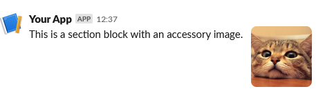

# Image block

An image next to some text.

```php
use Omnicolor\Slack\Response;
use Omnicolor\Slack\Sections\Image;

$response = (new Response())
    ->addBlock(new Image(
        'This is a section block with an accessory image.',
        'https://pbs.twimg.com/profile_images/625633822235693056/lNGUneLX_400x400.jpg',
        'cute cat',
    ));
echo json_encode($response);
```

Will produce this output:
```json
{
    "blocks": [
        {
			"type": "section",
			"text": {
				"type": "mrkdwn",
				"text": "This is a section block with an accessory image."
			},
			"accessory": {
				"type": "image",
				"image_url": "https://pbs.twimg.com/profile_images/625633822235693056/lNGUneLX_400x400.jpg",
				"alt_text": "cute cat"
			}
		}
    ],
    "response_type": "ephemeral"
}
```

And a Slack client will render it like:


