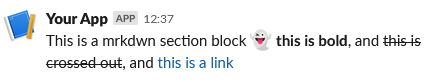

# Markdown block

A markdown-enabled text block.

```php
use Omnicolor\Slack\Response;
use Omnicolor\Slack\Sections\Text;

$response = (new Response())
    ->addBlock(new Text('This is a plain text section block.'));
echo json_encode($response);
```

Will produce this output:
```json
{
    "blocks": [
        {
			"type": "section",
			"text": {
				"type": "mrkdwn",
				"text": "This is a mrkdwn section block :ghost: *this is bold*, and ~this is crossed out~, and <https://google.com|this is a link>"
			}
		}
    ],
    "response_type": "ephemeral"
}
```

And a Slack client will render it like:


