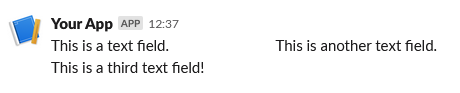

# Text fields block

A table-like group of text fields.

```php
use Omnicolor\Slack\Response;
use Omnicolor\Slack\Sections\Fields;
use Omnicolor\Slack\Sections\TextField;

// You can add an array of TextField objects in the constructor:
$fields = new Fields([new TextField('This is a text field.')]);

// Or add them one by one:
$fields->addField(new TextField('This is another text field.'));

// Or add an array of TextFields later:
$fields->addFields([new TextField('This is a third text field!')]);

$response = (new Response())->addBlock($fields);
echo json_encode($response);
```

Will produce this output:
```json
{
    "blocks": [
		{
			"type": "section",
			"fields": [
				{
					"type": "plain_text",
					"text": "This is a text field.",
					"emoji": true
				},
				{
					"type": "plain_text",
					"text": "This is another text field.",
					"emoji": true
				},
				{
					"type": "plain_text",
					"text": "This is a third text field!",
					"emoji": true
				}
			]
		}
	],
    "response_type": "ephemeral"
}
```

And a Slack client will render it like:


