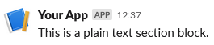

# Plain text block

A very basic bit of text.

```php
use Omnicolor\Slack\Response;
use Omnicolor\Slack\Sections\Text;

$response = (new Response())
    ->addBlock(new Text('This is a plain text section block.'));
echo json_encode($response);
```

Will produce this output:
```json
{
    "blocks": [
        {
            "type": "section",
            "text": {
                "type": "plain_text",
                "text": "This is a plain text section block.",
                "emoji": true
            }
        }
    ],
    "response_type": "ephemeral"
}
```

And a Slack client will render it like:

